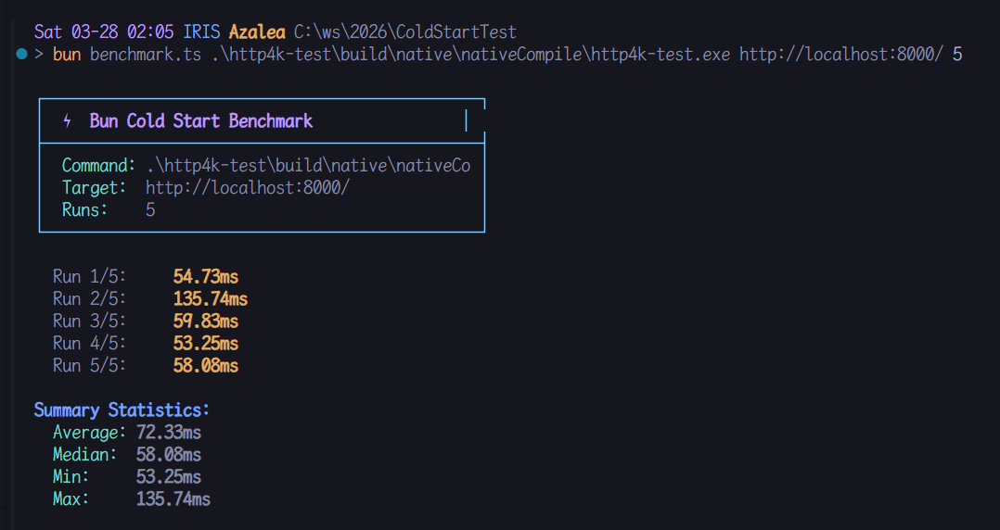
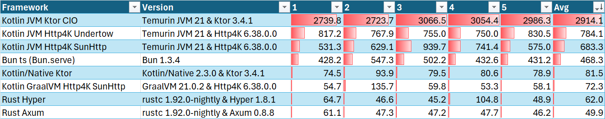

# ColdStartTest

Test of cold start time of different http server implementations.

## Benchmark

```bash
bun run benchmark.ts <command> <target> <runs>
```


## Results



| Framework | Version | 1 | 2 | 3 | 4 | 5 | Avg |
| --- | --- | --- | --- | --- | --- | --- | --- |
| Kotlin JVM Ktor CIO | Temurin JVM 21 & Ktor 3.4.1 | 2739.8 | 2723.7 | 3066.5 | 3054.4 | 2986.3 | 2914.1 |
| Kotlin JVM Http4K Undertow | Temurin JVM 21 & Http4K 6.38.0.0 | 817.2 | 767.9 | 755.0 | 750.0 | 830.5 | 784.1 |
| Kotlin JVM Http4K SunHttp | Temurin JVM 21 & Http4K 6.38.0.0 | 531.3 | 629.1 | 939.7 | 741.4 | 575.0 | 683.3 |
| Bun ts (Bun.serve) | Bun 1.3.4 | 428.2 | 547.3 | 502.2 | 432.6 | 431.2 | 468.3 |
| Kotlin/Native Ktor | Kotlin/Native 2.3.0 & Ktor 3.4.1 | 74.5 | 93.9 | 79.5 | 80.6 | 78.9 | 81.5 |
| Kotlin GraalVM Http4K SunHttp | GraalVM 21.0.2 & Http4K 6.38.0.0 | 54.7 | 135.7 | 59.8 | 53.3 | 58.1 | 72.3 |
| Rust Hyper | rustc 1.92.0-nightly & Hyper 1.8.1 | 64.7 | 46.6 | 45.2 | 104.8 | 48.9 | 62.0 |
| Rust Axum | rustc 1.92.0-nightly & Axum 0.8.8 | 61.1 | 47.3 | 47.2 | 47.7 | 46.2 | 49.9 |